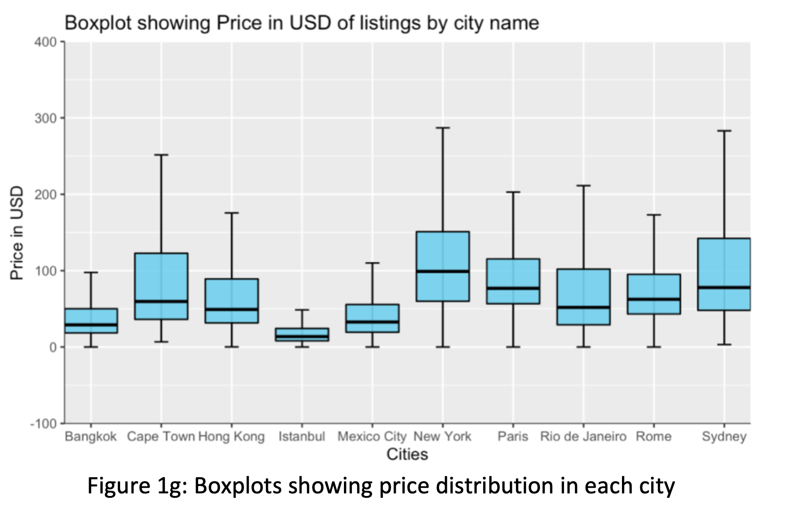

# [Airbnb Exploratory Data Analysis](https://github.com/imadahmad97/EDA-of-Airbnb-Data)

* Performed exploratory data analysis on two datasets containing information on Airbnb listings and their reviews 
* Cleaned and wrangling the data using **python** in conjunction with various libraries such as **Numpy and Pandas**. 
* Visualized relationships between chosen variables using visualization libraries such as **matplotlib, plotly, and seaborn**. 
* Visualized geographical data using the **GEOJSON** library 
* Visualized **natural language processing** from Airbnb listing titles using the **nltk** library
* Organized analysis with written report as a **Jupyter Notebook** or HTML file

# [Airbnb Statistical Analysis](https://github.com/imadahmad97/Statistical-Analysis-of-Airbnb-Data)

* Performed statistical analysis using **R** on two datasets containing information on Airbnb listings and their reviews
* Explored relationships between variables through statistical methods, including one/two sample t-tests, correlational calculations, etc.
* Visualized data in R using the **ggplot library**
* Utilized multiple statistical distributions, such as the normal distribution, t-distribution, Poisson distribution, etc.
* Organized analysis with written report as a PDF

# [Gender Disparity Amongst Physiology Departments](https://www.cureus.com/articles/46484-sex-disparity-among-faculty-of-physiology-in-north-american-academia-differences-in-scholarly-productivity-and-academic-rank)

* Explored if a gender disparty existed in physiology departments throughout North America
* Collected data from database Scopus
* Performed multiple analyses using **STATA**, including multiple linear regression, normality testing, etc.
* **Published** written report and analysis as **First Author**

